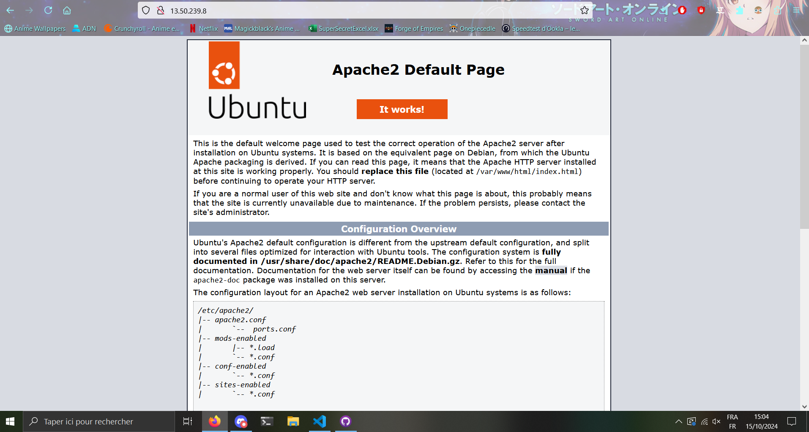

# Etude comparative des instances EC2
## Tableau avec toutes les instances EC2 répondant aux critères

| Instance name | Région     | On-Demand hourly rate | vCPU | Memory | Storage  |
|---------------|------------|-----------------------|------|--------|----------|
| t2.small      | Frankfurt  | $0.0268                | 1    | 2 GiB  | EBS Only |
| t4g.small     | Frankfurt  | $0.0192                | 2    | 2 GiB  | EBS Only |
| t3.small      | Frankfurt  | $0.0240                | 2    | 2 GiB  | EBS Only |
| t3a.small     | Frankfurt  | $0.0216                | 2    | 2 GiB  | EBS Only |
| t2.small      | Ireland    | $0.0250                | 1    | 2 GiB  | EBS Only |
| t4g.small     | Ireland    | $0.0184                | 2    | 2 GiB  | EBS Only |
| t3.small      | Ireland    | $0.0228                | 2    | 2 GiB  | EBS Only |
| t3a.small     | Ireland    | $0.0204                | 2    | 2 GiB  | EBS Only |
| t2.small      | London     | $0.0260                | 1    | 2 GiB  | EBS Only |
| t4g.small     | London     | $0.0188                | 2    | 2 GiB  | EBS Only |
| t3.small      | London     | $0.0236                | 2    | 2 GiB  | EBS Only |
| t3a.small     | London     | $0.0212                | 2    | 2 GiB  | EBS Only |
| t4g.small     | Milan      | $0.0192                | 2    | 2 GiB  | EBS Only |
| t3.small      | Milan      | $0.0240                | 2    | 2 GiB  | EBS Only |
| t3a.small     | Milan      | $0.0216                | 2    | 2 GiB  | EBS Only |
| t2.small      | Paris      | $0.0264                | 1    | 2 GiB  | EBS Only |
| t4g.small     | Paris      | $0.0188                | 2    | 2 GiB  | EBS Only |
| t3.small      | Paris      | $0.0236                | 2    | 2 GiB  | EBS Only |
| t3a.small     | Paris      | $0.0212                | 2    | 2 GiB  | EBS Only |
| t4g.small     | Spain      | $0.0184                | 2    | 2 GiB  | EBS Only |
| t3.small      | Spain      | $0.0228                | 2    | 2 GiB  | EBS Only |
| t4g.small     | Stockholm  | $0.0172                | 2    | 2 GiB  | EBS Only |
| t3.small      | Stockholm  | $0.0216                | 2    | 2 GiB  | EBS Only |
| t4g.small     | Zurich     | $0.0211                | 2    | 2 GiB  | EBS Only |
| t3.small      | Zurich     | $0.0264                | 2    | 2 GiB  | EBS Only |

## Tableau comparatif des tarifs horaires des instances EC2

| Instance Type | Frankfurt | Ireland | London | Milan | Paris | Spain | Stockholm | Zurich |
|---------------|-----------|---------|--------|-------|-------|-------|-----------|--------|
| **t2.small**  | $0.0268   | $0.0250 | $0.0260 | N/A   | $0.0264 | N/A   | N/A       | N/A    |
| **t3.small**  | $0.0240   | $0.0228 | $0.0236 | $0.0240 | $0.0236 | $0.0228 | $0.0216   | $0.0264 |
| **t3a.small** | $0.0216   | $0.0204 | $0.0212 | $0.0216 | $0.0212 | N/A   | N/A       | N/A    |
| **t4g.small** | $0.0192   | $0.0184 | $0.0188 | $0.0192 | $0.0188 | $0.0184 | $0.0172   | $0.0211 |

# Information sur l'instance EC2 

    ID de l'instance: i-085fdadb520d66c74
    Type d'instance: t4g.small
    ID de l'AMI: ami-0dcbfe330b31195ff
    L'IP publique associée à l'instance: 13.50.239.8
    Le FQDN public associé à l'instance: ec2-13-50-239-8.eu-north-1.compute.amazonaws.com
    L'IP privée associée à l'instance: 172.31.9.134
    L'ID du VPC dans lequel est déployée l'instance: vpc-0dd372cf8bae91791
    L'ID du sous-réseau dans lequel est déployée l'instance: subnet-0330a3ea614d82bbe
    L'AZ dans laquelle est déployée l'instance: eu-north-1c
    L'ID de l'interface réseau associée à l'instance: eni-08d7907b158d733e9
    L'ID du volume attaché à l'instance: vol-0cffa392cdc5ea88c
    La taille du volume attaché à l'instance: 8

# Page d'accueil du serveur web

