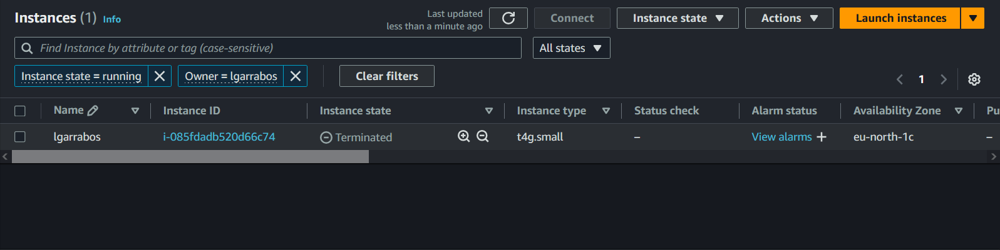
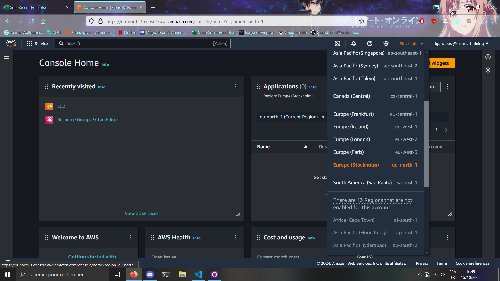

# Supprimer vos resources



# Instance EC2 avec Apache2

## Configuration de l'instance EC2

La premiére étape et de chosir la région dans laquelle vous allez créer votre instance EC2. Pour cela rendez vous sur votre console AWS et cliquez sur le menu déroulant en haut à droite de la page. Choisissez la région de Europe (Stockholm).



Pour commencer rendez vous sur votre console AWS et cliquez sur le service EC2.
Ensuite cliquez sur le bouton "Launch Instance" pour créer une nouvelle instance.


Remplissez les informations de tag de l'instance comme ci-dessous:


Dans la partie Application and OS Image, changer votre architecture pour vous mettre en 64-bit (Arm), choisissez ensuite l'os Ubuntu server 24.04 LTS.


Choisissez ensuite le type d'instance ici le type t4g.small.


Pour la Key Pair ne pas en créer.


Pour la partie network settings nous allons choisir un groupe déjà existant qui est le default.


On ne change pas le storage donc on peut ensuite cliquer sur le bouton "Launch".


## Connexion à l'instance EC2 et installation d'Apache2

Pour se connecter à l'instance EC2 nous allons utiliser EC2 Instance Connect.
Pour cela rendez vous sur votre console AWS et cliquez sur le service EC2.
Cherchez votre instance et cliquez sur le bouton "Connect". (Vous pouvez utiliser les tags pour la retrouver plus facilement). Avant de vous connecter assurez vous que votre instance est bien en running. Profitez en pour noter l'IP publique de votre instance que vous pouvez voir en fesant défilier les infos vers la droite.


Sur la page qui s'ouvre cliquez sur le bouton "Connect" pour vous connecter à votre instance.

Une console s'ouvre rentrer dedans la commande suivante pour installer apache2:
```bash
sudo apt install apache2
```
Et pour vérifier que le serveur est bien installé entrer l'ip publique de votre instance dans votre navigateur web. Vous devriez voir la page d'accueil d'apache2.


# Temps de travail

## Configuration de l'instance EC2
 Environ 5 minutes

 ## Connexion à l'instance EC2 et installation d'Apache2
 Environ 2 minutes