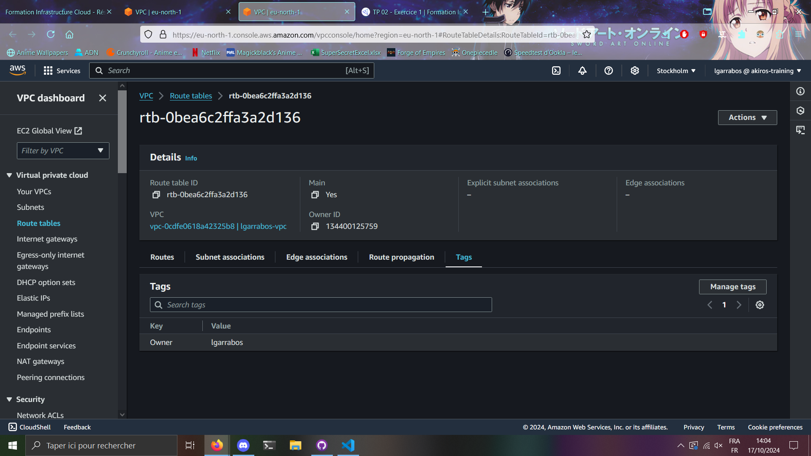
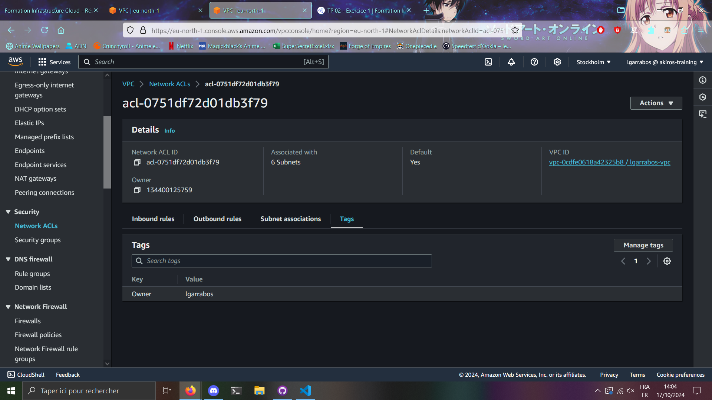
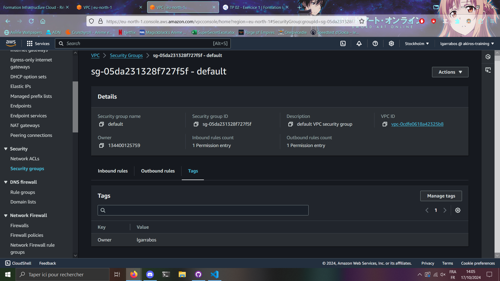
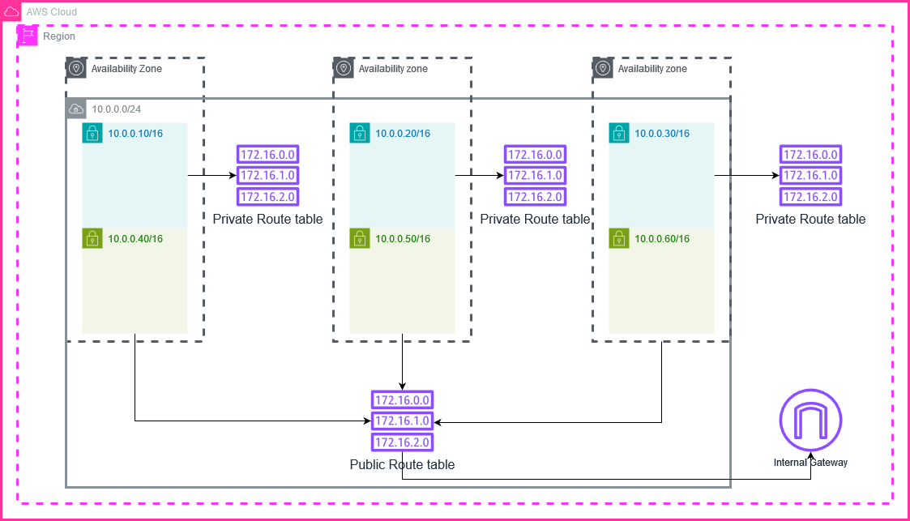

# Récupération des informations

## VPC

Id: vpc-0cdfe0618a42325b8
Nom: lgarrabos
Plage d'adresses IP: 10.0.0.0/16

## Subnet
### Public

Id: subnet-0ac37aa2b530acc6c

Nom: lgarrabos-subnet-public1-eu-north-1a

Plage d'adresses IP: 10.0.10.0/24

AZ: eu-north-1a

Route table associée: lgarrabos-rtb-public

---
Id: subnet-0a20b87ab352d2fc2

Nom: lgarrabos-subnet-public2-eu-north-1b

Plage d'adresses IP: 10.0.20.0/24

AZ: eu-north-1b

Route table associée: lgarrabos-rtb-public

---
Id: subnet-018fcee7023b4cfe0

Nom: lgarrabos-subnet-public3-eu-north-1c

Plage d'adresses IP: 10.0.30.0/24

AZ: eu-north-1c

Route table associée: lgarrabos-rtb-public

---
### Private

Id: subnet-03a1004e8ed333e67

Nom: lgarrabos-subnet-private1-eu-north-1a

Plage d'adresses IP: 10.0.40.0/24

AZ: eu-north-1a

 
lgarrabos-rtb-private1-eu-north-1a

---
Id: subnet-0df7461b306222b7a

Nom: lgarrabos-subnet-private2-eu-north-1b

Plage d'adresses IP: 10.0.50.0/24

AZ: eu-north-1b

Route table associée: lgarrabos-rtb-private2-eu-north-1b

---
Id: subnet-016a8a17a61d3bfe4

Nom: lgarrabos-subnet-private3-eu-north-1c

Plage d'adresses IP: 10.0.60.0/24

AZ: eu-north-1c

Route table associée: lgarrabos-rtb-private3-eu-north-1c

---
## Internet Gateway

Id: igw-0780dc94bf1c93f81

Nom: lgarrabos-igw

## Route Table
### Default

Id: rtb-0bea6c2ffa3a2d136

Nom: rtb-0bea6c2ffa3a2d136

Route:
- Destination:10.0.0.0/16
- Target: local

### Public

id: rtb-0aead7c31c545ac0d

Nom: lgarrabos-rtb-public

Route:
- Destination: 0.0.0.0/0
- Target: igw-0780dc94bf1c93f81
---
- Destination: 10.0.0.0/16
- Target: local

### Private

id: rtb-05325e0a700a34a36

Nom: lgarrabos-rtb-private2-eu-north-1b

Route:
- Destination: 10.0.0.0/16
- Target: local

id: rtb-02c81366be8e93343

Nom: lgarrabos-rtb-private1-eu-north-1a

Route:
- Destination: 10.0.0.0/16
- Target: local

id: rtb-097e6830cfbef8481

Nom: lgarrabos-rtb-private3-eu-north-1c

Route:
- Destination: 10.0.0.0/16
- Target: local

## ACL

id: acl-0751df72d01db3f79

## Security Group

id: sg-05da231328f727f5f

# Tags des ressources

Route Table par défaut:

ACL par défaut:

Security Group par défaut:

# Shéma réseau

