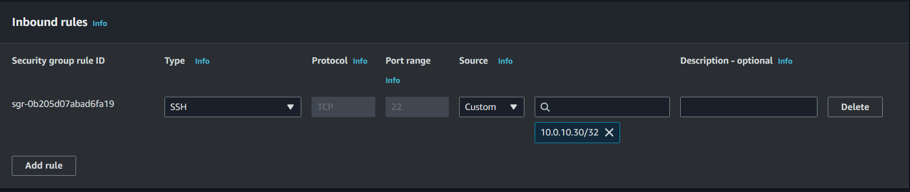
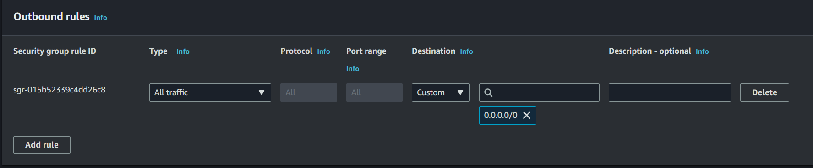
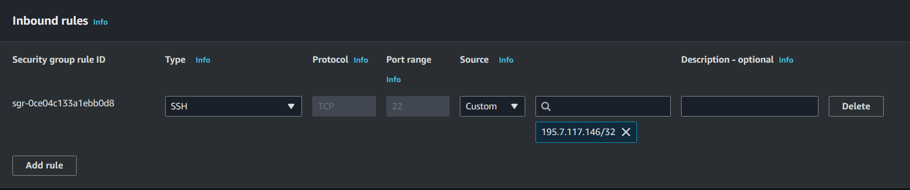
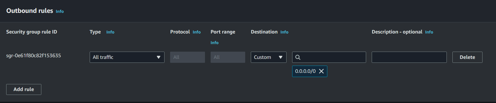

# Information
## Instance EC2

Id: i-026399076a7639689

Nom: lgarrabos-nextcloud

Type: t3.micro

Ip publique: /

Ip privée: 10.0.40.89

Subnet: lgarrabos-subnet-private1-eu-north-1a

Security Group: Nextcloud

Key Pair: lgarrabos-nextcloud-key

---

Id: i-0cfcac91f613b668a

Nom: lgarrabos-bastion

Type: t3.micro

Ip publique: 16.171.239.233

Ip privée: 10.0.10.135

Subnet: lgarrabos-subnet-public1-eu-north-1a

Security Group: Bastion

Key Pair: lgarrabos-bastion-key

## Security Group

Id: sg-07826c1a45e96ce56

Nom: Nextcloud

Régles entrantes:

Régles sortantes: 

---

Id: sg-007a356bcc5dcf918

Nom: Bastion

Régles entrantes: 

Régles sortantes: 

## Network ACL
