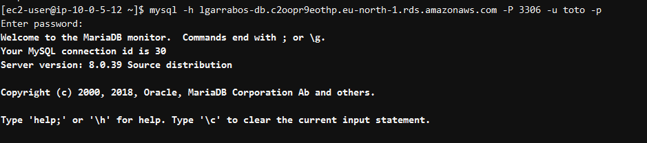
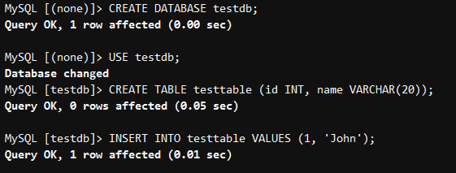
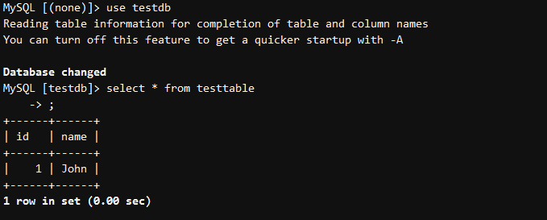

# Documentation
## Procédure et résultats des tests de connectivité

### 1. Connexion à la base de données
Installer le client MySQL sur l'instance EC2 Nextcloud :

```bash
sudo yum install -y mysql
```

Pour se connecter à la base de données, il faut utiliser le client MySQL en ligne de commande. Voici la commande à exécuter :

```bash
mysql -h <endpoint> -u <username> -p
```


## 2. Création d'une base de données test

Une fois connecté à la base de données, on peut créer une base de données de test. Voici les commandes à exécuter :

```sql
CREATE DATABASE testdb;
USE testdb;
CREATE TABLE testtable (id INT, name VARCHAR(20));
INSERT INTO testtable VALUES (1, 'John');
```


## 3. Procédure de test de failover

Pour tester la résilience de la base de données, on va simuler une panne de l'instance RDS en arrêtant relancant l'instance manuellement. Voici les étapes à suivre :

1. Se connecter à la console AWS et trouver l'instance RDS à arrêter.
2. Activer le redémarrage de l'instance en cliquant sur "Reboot".
3. Cocher l'options "Force failover" pour forcer le basculement de l'instance.
4. Vérifier l'état de l'instance pour confirmer qu'elle est bien en redémarage.
5. Se connecter à l'instance EC2 Nextcloud et essayer de se connecter à la base de données.


## 4. Résultats du test de failover

Pendant le redémarrage de l'instance RDS, on à pu constater que l'instance EC2 Nextcloud était toujours en mesure de se connecter à la base de données grace au failover automatique.) 



## 5. Conclusion

Ce test de failover a permis de confirmer que l'instance EC2 Nextcloud est bien configurée pour supporter les pannes de l'instance RDS. Le failover automatique a bien fonctionné nous avons pu nous connecter à la base de données sans problème pendant le redémarrage de l'instance RDS.