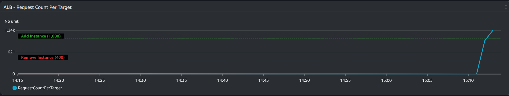
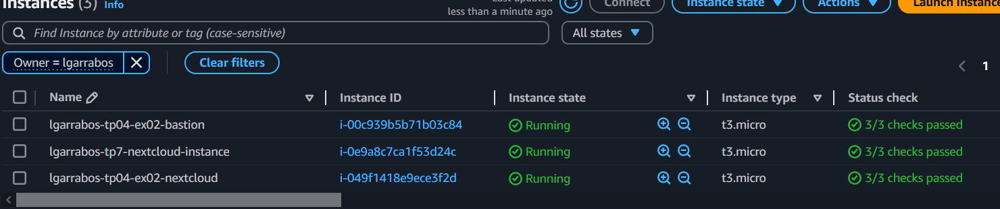

Comme on peut le voir sur les deux images si dessus lorsque le nombre de requete à dépasser les 1000 requetes par minute, le nombre d'instance augmente automatiquement pour pouvoir supporter le nombre de requete.